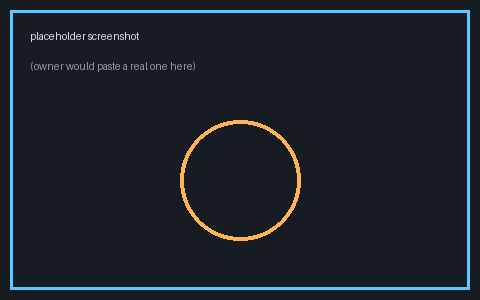

## What happened this week

This is placeholder body text standing in for a real weekly update. A real
update would summarize what shipped, what the numbers say, and what's
blocking. It's written in plain markdown — headings, lists, tables, and
images all work the same way they would in any other markdown file.

## Results snapshot

| run | data | epoch | val IoU@0.2 | notes |
|---|---|---|---|---|
| W5 (eager) | train_1k | ep18 | 0.176 | 5x loss weight on emissive voxels |
| W1 (control) | train_1k | ep18 | 0.142 | plain loss, same schedule |
| zero-shot oracle | — | — | ~0.235 | frozen pretrained full_seg, the bar to beat |

## A figure pulled from an existing page

This image is **not copied** — it's a relative link straight into the already
published `finetune_binary_v1` page, so there is exactly one copy of the file
on disk.

## A figure from this update's own figs/

This image *is* copied alongside the published page (it lives in this
update's own `figs/` directory and nowhere else).

## What's next

- Wire the real owner-authored update into this same convention.
- Confirm the console home lists updates newest-first with their tldr.
- Retire this template once a real update has been published successfully.
